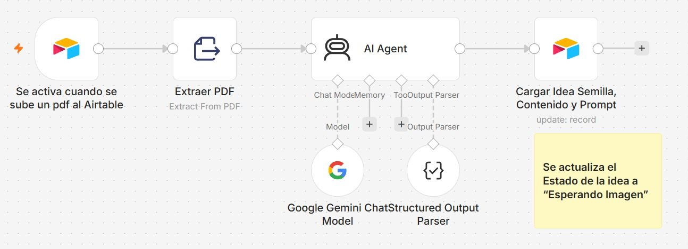
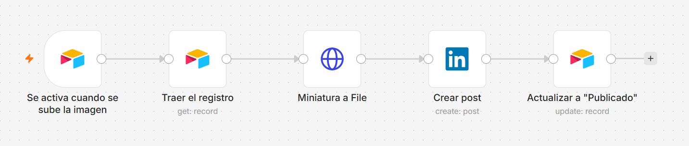
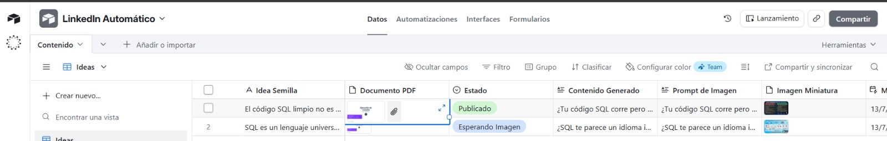

# LinkedIn Automático

Ecosistema de automatización que transforma documentos técnicos (PDF) en publicaciones profesionales de LinkedIn, combinando un agente de IA para la redacción de contenido con un punto de intervención manual para la generación de la imagen miniatura.

## 📌 Descripción

El sistema toma un PDF fuente, extrae su contenido y utiliza un agente de IA (Google Gemini) para generar una idea de post, el texto final y un prompt descriptivo para la imagen que lo acompañará. Por restricciones técnicas de integración HTTP y de presupuesto, la generación de la imagen se resuelve manualmente: el administrador la crea a partir del prompt sugerido y la carga en Airtable, lo que dispara automáticamente la publicación en LinkedIn.

El proyecto está dividido en dos workflows de n8n, desacoplados entre sí y disparados por eventos distintos sobre la misma base de Airtable.

## 🛠️ Stack Tecnológico

- **n8n** — Orquestador principal de los workflows
- **Airtable** — Base de datos y motor de estados
- **Google Gemini** — Modelo de lenguaje del AI Agent
- **Extract From PDF** — Extracción de texto del documento fuente
- **HTTP Request** — Conversión de adjuntos de Airtable a archivo binario
- **LinkedIn API** — Publicación del contenido final

## 🔄 Arquitectura

### Fase 1 · Generación de Idea, Contenido y Prompt de Imagen
Se activa al subir un PDF a Airtable. Extrae el texto del documento, lo procesa con un AI Agent (Google Gemini + Structured Output Parser) que redacta la idea semilla, el contenido del post y el prompt de imagen, y actualiza el registro con estado `Esperando Imagen`.



### Intervención Manual · Creación de la Imagen Miniatura
El administrador usa el prompt generado para crear la imagen (por fuera de n8n) y la carga como adjunto en el registro de Airtable. Esta acción dispara la Fase 2.

### Fase 2 · Publicación Automática en LinkedIn
Se activa al subir la imagen. Recupera el registro, convierte la miniatura a archivo binario y publica el post completo en LinkedIn. Actualiza el estado a `Publicado`.



## 🗂️ Estructura de la Base de Datos (Airtable)

| Campo | Tipo | Función |
|---|---|---|
| Idea Semilla | Texto | Concepto o tema central del post, generado por la IA |
| Documento PDF | Attachment | Documento técnico original |
| Estado | Single Select | `Esperando Imagen` → `Publicado` |
| Contenido Generado | Long Text | Post final redactado por la IA |
| Prompt de Imagen | Texto | Prompt para la creación manual de la miniatura |
| Imagen Miniatura | Attachment | Imagen final cargada manualmente |



## 📁 Estructura del Repositorio

```
linkedin-automatico/
├── README.md
├── workflows/
│   ├── 01_generacion_contenido.json
│   └── 02_publicacion_linkedin.json
├── docs/
│   └── Proyecto_Final_LinkedIn_Automatico.docx
├── evidencias/
│   ├── workflow_1.png
│   ├── workflow_2.png
│   └── airtable_tabla_ideas.png
└── prompts/
    └── system_prompt_ai_agent.txt
```

## 🔗 Enlaces

- **Video demo (3 min):** [[VIDEO_DEMO]](https://drive.google.com/file/d/14NUWJCYponBOTCJr-AZHIc5LdDflCoAg/view?usp=sharing )
- **Documento del proyecto:** [`docs/Proyecto_Final_LinkedIn_Automatico.pdf`](docs/Proyecto_Final_LinkedIn_Automatico.pdf)

## ⚠️ Nota de Diseño

La generación automática de imágenes no se implementó debido a limitaciones en la integración HTTP con servicios de generación de imágenes y a restricciones de presupuesto para APIs de pago. En su lugar, se optó por un paso de intervención manual, que además funciona como punto de control editorial antes de la publicación final.

## 👤 Autor

Erick Miranda
